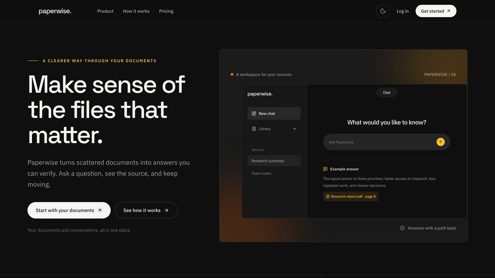
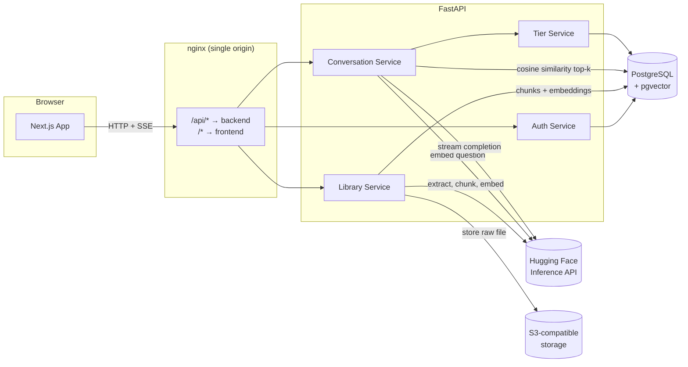

# Paperwise

An AI document assistant with retrieval-augmented generation (RAG) chat. Upload a PDF, TXT, or Markdown file and ask questions about it — Paperwise chunks and embeds the document, retrieves the most relevant sections for each question via vector similarity search, and streams back an answer grounded in that content, with citations back to the source sections.

Full-stack, production-shaped project: typed API contracts, layered backend architecture, JWT + OAuth + magic-link auth, tiered usage limits enforced server-side, and a containerized deployment behind an nginx reverse proxy.



## How it works



**Ingestion**: an uploaded file is hashed (sha256) to reject duplicates, its text is extracted (PyMuPDF for PDF, `python-docx` for Word), split into ~500-character overlapping chunks, embedded via Hugging Face's Inference API, and only written to Postgres once every step succeeds — a failed embedding call never leaves a broken document row that would still count against the user's plan quota.

**Retrieval + answering**: a question is embedded with the same model, and `pgvector`'s cosine-distance operator finds the top-k nearest chunks directly in SQL. Those chunks are assembled into a prompt with the question, sent to the chat model, and the response is streamed back to the browser token-by-token over Server-Sent Events — the UI renders it incrementally rather than waiting for the full answer.

## Features

- **Auth** — email/password, Google OAuth, and passwordless magic links, all issuing the same `httponly`/`Secure` JWT access + refresh cookie pair
- **Document library** — upload PDF/TXT/MD, content-hash deduplication (rejects a re-upload before it touches storage or the embedding API), per-plan file-size and file-type limits
- **RAG chat** — streamed, cited answers over your own documents; conversation history persisted per user
- **Onboarding** — guided first-run flow that hands the first question straight into a real dashboard conversation
- **Analytics** — usage dashboard
- **Plans**, enforced server-side per request:

  | | Free | Pro |
  |---|---|---|
  | Documents | 5 | Unlimited |
  | Max file size | 10 MB | 50 MB |
  | File types | pdf, txt, md | pdf, docx, txt, md |
  | Queries / day | 20 | Unlimited |
  | Conversation history | 7 days | Unlimited |

- **Waitlist** — public signup capture for pre-launch traffic

## Engineering notes

A few decisions worth calling out, since they came from real bugs found and fixed during development rather than being designed in up front:

- **Exception architecture** — services raise typed exceptions (`NotFoundError`, `PlanLimitError`, `UploadFailedError`, ...) from `core/exceptions.py`; a small set of centralized FastAPI exception handlers in `core/exception_handlers.py` map them to HTTP status codes and response shapes. Routes stay one-liners with no `try/except` scattered through the API layer.
- **SSE streams always terminate.** The `/ask` endpoint sends its final `[DONE]` event from a `finally` block, not the happy path — an unhandled exception mid-stream used to skip it entirely, leaving the frontend's "streaming" state stuck forever with no error shown.
- **React 18 Strict Mode-safe effects.** A couple of effects with real side effects (creating a conversation, sending a question) are guarded with refs rather than relying on dependency-array identity, since Strict Mode's dev-only double-invoke of effects will otherwise fire a network call twice and produce visibly duplicated/interleaved streamed output.
- **Prompt-injection-adjacent bug**: documents that are themselves full of questions (e.g. a homework/quiz PDF) could get their embedded "Question: ..." text confused with the user's actual question by the LLM, since both looked identical in a naive prompt. Fixed by explicitly delimiting retrieved context and telling the model never to treat text inside it as the question to answer — verified against the live model with a reproduction before and after.
- **Same-origin auth by construction.** Cookies are `httponly` + `SameSite=Lax`, which breaks across unrelated domains. Rather than relaxing cookie security or reaching for a token-in-header scheme, the Docker deployment puts an nginx reverse proxy in front of both services so the browser only ever sees one origin — this also means CORS is a non-issue for real browser traffic.
- **Tests as a safety net, not a checkbox.** Adding the upload content-hash dedup check broke 4 existing service tests that mocked the uploaded file incompletely — they caught a real behavior change immediately rather than silently passing against stale assumptions. `pytest`/`pytest-asyncio` weren't actually declared in `requirements.txt` despite the suite depending on them; fixed alongside.

## Tech stack

**Frontend** — Next.js 15 (App Router), React 19, TypeScript, Tailwind CSS 4, axios, `@microsoft/fetch-event-source` for SSE streaming.

**Backend** — FastAPI, SQLAlchemy + Alembic, PostgreSQL with `pgvector` for embedding search, Authlib for Google OAuth, `boto3` for S3-compatible object storage, Hugging Face Inference API for embeddings and chat completion.

**Infra** — Postgres + S3-compatible storage via Supabase; Docker + nginx for containerized deployment.

## Project structure

```
backend/
  src/
    api/v1/          route handlers (auth, users, library, conversations, analytics, misc)
    services/         business logic (auth, library, conversation, tier limits, waitlist)
    repositories/      DB access layer
    models/            SQLAlchemy models
    schemas/            Pydantic request/response schemas
    core/               exceptions, exception handlers, shared enums, DI dependencies
    utils/              HF client, text chunking/extraction, storage, query prompting
  alembic/             DB migrations
  tests/                pytest suite

frontend/
  src/
    app/                Next.js routes: (auth), (app)/dashboard, (app)/settings (including usage), onboarding, pricing, privacy, terms
    components/          UI components (conversations, sidebar, settings, etc.)
    hooks/                useSSEStream, useLibrary, etc.
    lib/api/              typed API client functions
    context/              AuthContext, AppLayoutContext

nginx/                  reverse proxy config for the Docker setup
docker-compose.yml
```

## Getting started

### Prerequisites

- Node.js 20+
- Python 3.11+
- A PostgreSQL database with the `pgvector` extension (e.g. [Supabase](https://supabase.com))
- An S3-compatible bucket (e.g. Supabase Storage)
- A Hugging Face API key with Inference Providers access
- (Optional) Google OAuth credentials, SMTP credentials for magic links/password reset

### 1. Backend

```bash
cd backend
python3 -m venv .venv && source .venv/bin/activate
pip install -r requirements.txt
cp .env.example .env   # fill in DATABASE_URL, JWT/SESSION secrets, HF_API_KEY, S3_*, etc.
alembic upgrade head
uvicorn src.main:app --reload --port 8000
```

The API is served at `http://localhost:8000/api`, with interactive docs at `http://localhost:8000/docs`.

### 2. Frontend

```bash
cd frontend
npm install
cp .env.example .env.local   # set NEXT_PUBLIC_BACKEND_URL=http://localhost:8000/api
npm run dev
```

The app runs at `http://localhost:3000`.

For Google sign-in while running the services directly, keep `APP_URL=http://localhost:3000` and `GOOGLE_REDIRECT_URI=http://localhost:8000/api/v1/auth/google/callback` in `backend/.env`. Add that exact callback URL to the Google OAuth web client's **Authorized redirect URIs**. Google matches the scheme, host, port, and path exactly.

> Both `.env.example` files exist as templates — copy them rather than editing in place, and never commit the real `.env`.

### Running with Docker

```bash
docker compose up --build
```

This builds and runs three containers — `backend`, `frontend`, and an `nginx` reverse proxy — all served from `http://localhost` (port 80). nginx routes `/api/*` to the backend and everything else to the frontend, so both share one origin (required for the auth cookies to work) and the browser talks to a single host. The backend container runs `alembic upgrade head` automatically before starting `uvicorn`.

Requires `backend/.env` to exist locally (same as above) — `docker-compose.yml` loads it via `env_file`. For this mode, set:

```
APP_URL=http://localhost
GOOGLE_REDIRECT_URI=http://localhost/api/v1/auth/google/callback
```

Add this Docker callback URL to the same OAuth client's **Authorized redirect URIs** if you also use Docker locally.

Note nginx here terminates plain HTTP; since auth cookies are set `Secure`, you'll need TLS in front of it (a cloud load balancer, Cloudflare, or similar) before deploying this beyond `localhost`.

### Production Deployment

Runs on a single AWS EC2 instance (t3.small) via this same `docker-compose.yml`, plus a `certbot` service that issues and auto-renews a Let's Encrypt certificate for the production domain. nginx serves HTTP only for the ACME challenge path and redirects everything else to HTTPS.

- Live at `https://paperwise.chaturved-sumanth-lakkaraju.com`
- `deploy.sh` — pulls latest `main` and runs `docker compose up -d --build` on the instance
- `.github/workflows/deploy.yml` — manually triggered from the Actions tab; runs backend `pytest` + frontend `lint`/`build`, then deploys via `deploy.sh` over SSH (a "skip tests" checkbox allows a force-deploy)
- First-time cert issuance (already done for the current domain, only needed again for a new domain):
  ```bash
  docker compose run --rm --entrypoint certbot certbot certonly --webroot -w /var/www/certbot -d <domain> --email <email> --agree-tos --no-eff-email
  ```

## Testing

```bash
cd backend
pytest
```

153 unit tests covering services and repositories with mocked dependencies (auth, library, conversation, tier enforcement, dedup).

## Further reading

[`SPEC.md`](SPEC.md) has the full data model, API contract, and design rationale in more depth than this README.

## License

Copyright 2026 Chaturved Lakkaraju. All rights reserved. This project is proprietary; see [LICENSE](LICENSE) for terms.
